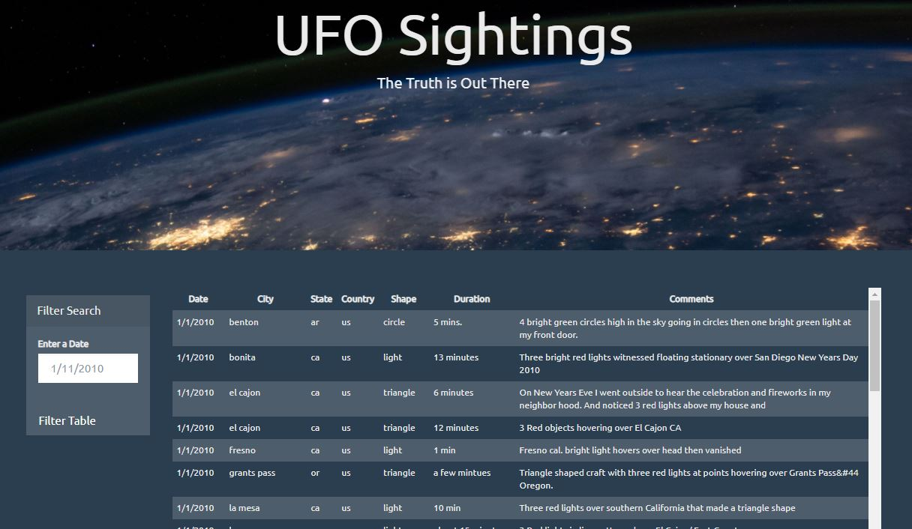
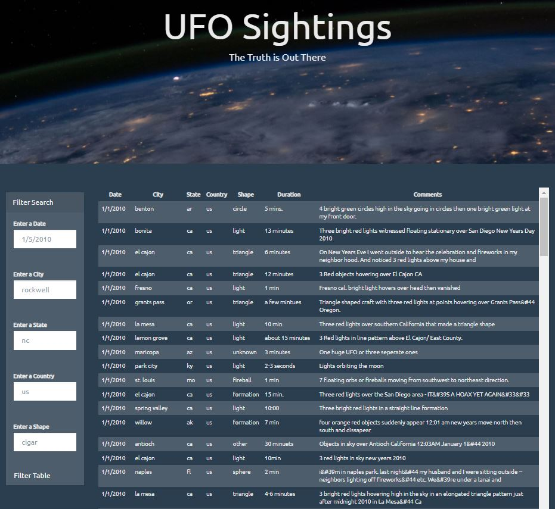
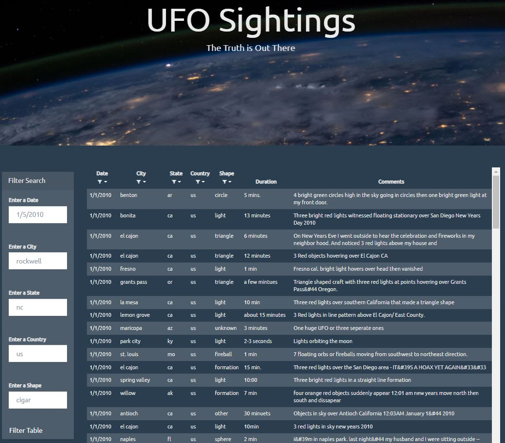
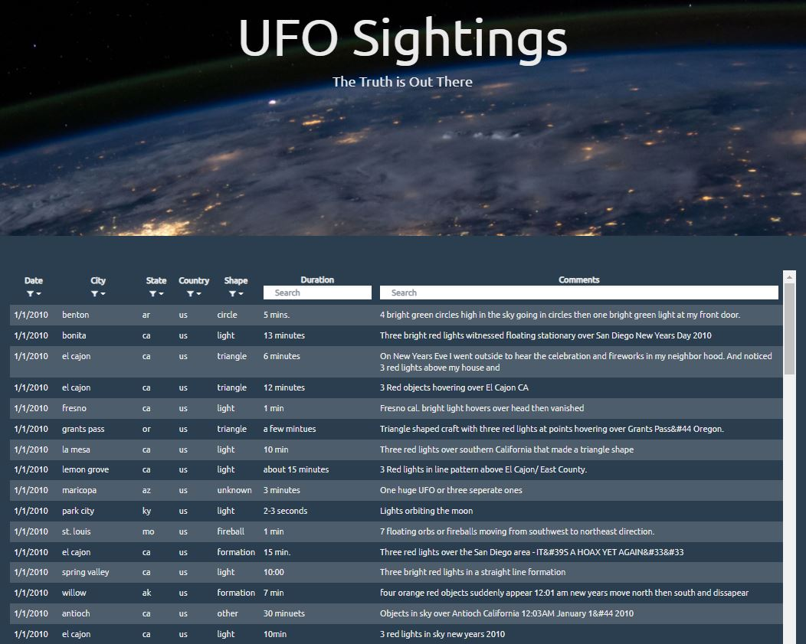

# UFO Sightings Data Filters
JavaScript project for Monash Data Analytics Boot Camp

The purpose of this project was to build a web application that dynamically creates a table from the fictitious UFO Sightings Data and allows user to filter the data for specific values.

# Data

There is one key source of data used:

* [UFO Sightings Data](UFO-level-1/static/js/data.js) - .js file with UFO sightings data 

# Analysis

### UFO level 1

* Create a basic HTML web page

* Using the UFO dataset write code that appends a table to web page and then adds new rows of data for each UFO sighting

* Use a date form in HTML document and write JavaScript code that will listen for events and search through the `date` column to find rows that match user input:

  

### UFO level 2: Multiple Search Categories

* Using multiple `input` tags write JavaScript code so the user can to set multiple filters and search for UFO sightings using the following criteria based on the table columns:

  1. `date`
  2. `city`
  3. `state`
  4. `country`
  5. `shape`

  

### UFO level 2 with dropdowns: Multiple Search Categories and In-table Dropdown Filters

* Using multiple `input` tags and select dropdowns write JavaScript code so the user can to set multiple filters and search for UFO sightings using the following criteria based on the table columns:

  1. `date`
  2. `city`
  3. `state`
  4. `country`
  5. `shape`

  

### UFO level 2 full table filter: In-table Dropdown Filters and Search Boxes

* Using multiple select dropdowns and `input` tags write JavaScript code so the user can to set multiple filters and search for UFO sightings using the following criteria based on the table columns:

  1. `date`
  2. `city`
  3. `state`
  4. `country`
  5. `shape`
  6. `duration`
  7. `comments`

  

# Demo

To run the examples locally save the chosen folder and run the `index.html` file in your web browser. 

# Used Tools
 * JavaScript
 * HTML
 * CSS

 

